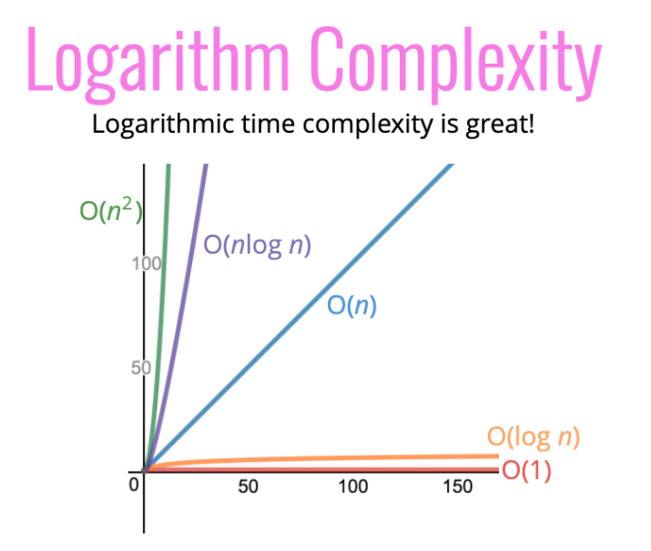

# Big O notation

* precise vocabulary for code performance 
* for discussing trade-offs
* identifying ineffiencient parts of your code that might lead to problems. for debugging

--------------------------------

What does better mean?

* faster?
* less memory-intensive?
* more readable?

----------------------------------

if not time, then what?

rather counting seconds, which are variable, we can count the number of simple operations the 
computer has to perform

```javascript
function addUpTo(n) {
  return n * (n + 1) / 2;
}

// Big O = O(1) -> constant runtime
```

3 operations -> 1 multiplication, 1 addition, 1 division

```javascript
export function addUpTo(n) {
  let total = 0;
  for (let i = 1; i <= n; i++) {
    total += i;
  }
  return total;
}

// Big O = O(n) -> linear runtime
```

n operations, 1 addition and 1 variable reassignment
i++ -> 1 addition and 1 reassignment
1 <= n -> n comparisons

-> depending on our count the second algorithm could be between 2n or 5n + 2

regardless of the exact number, the number of operations grows roughly proportionally with n
If n doubles, the number of operations will also roughly double

## Big O Intro
* a way to formalize fuzzy counting
* allows us to talk formally about how the runtime of an algorithm grows as the inputs grow
* we only care about the general trend of the relationship input to operations

## Big O Definition
An algorithm is O(f(n)) if the number of simple operations the computer has to do is eventually less than a constant times f(n), as n increases

* f(n) could be linear (f(n) = n)
* f(n) could be quadratic (f(n) = n^2)
* f(n) could be constant (f(n) = 1)
* f(n) could be something entirely different!

```javascript
function printAllPairs(n) {
  for (var i = 0; i < n; i++) {
    for (var j = 0; j < n; j++) {
      console.log(i, j);
    }
  }
}

// Big O = O(n^1) -> quadratic runtime
```

## Simplifying Big O Expressions
When determining the time complexity of an algorithm, there are some helpful rule of thumbs for big O expressions.

* constants don't matter ( O(1000n^2) -> O(n^2) )
* smaller terms don't matter ( O(n^2 + 5n + 8) -> O(n^2) )

There are several rules of thumb that can help to determine complexity
These rules won't ALWAYS work, but are a helpful starting point

* Arithmetic operations are constant
* Variable assignment is constant
* Accessing elements in an array (by index) or object (by key) is constant
* In a loop, the complexity is the length of the loop times the complexity of whatever happens inside of the loop

```javascript
function logAtLeast5(n) {
  for (var i = 1; i <= Math.max(5, n); i++) {
    console.log(i);
  }
}
//  O(n) -> linear runtime complexity
```

```javascript
function logAtMost5(n) {
  for (var i = 1; i <= Math.min(5, n); i++) {
    console.log(i);
  }
}
//  O(1) -> constant runtime complexity
```

## Space Complexity
We can also use big O notation to analyze space complexity: how much additional memory do we need to allocate in order to run the code in our algorithm?

space complexity or auxiliary space complexity refers to the space that is required by the algorithm, not including the space taken up by the inputs.

When we talk about space complexity, technically we'll be talking about auxiliary space complexity.

Rules of thumb:
* Most primitives (booleans, numbers, undefined, null) are constant space
* Strings require O(n) space (where n is the string length)
* Reference types are generally O(n), where n is the length (for arrays) or the number of keys (for objects)

```javascript
function sum(arr) {
  let total = 0;
  for (let i = 0; i < arr.length; i++) {
    total += arr[i];
  }
  return total;
}

// only two variables, which are of type int -> constant space complexity O(1)
```

```javascript
function double(arr) {
  let newArr = [];
  for (let i = 0; i < arr.length; i++) {
    newArr.push(2 * arr[i]);
  }
  return newArr;
}

// space that is taken up is directly proportional to the size of the input array 
// -> linear space complexity O(n)
```

## Logarithmic complexity

logaritms are the counterpart of exponentiation

Example:
```
log_2 (8) = 3 -> 2^3 = 8
log_2 (value) = exponent -> 2^exponent = value
```

log === log_2 (log base 2)

Rule of thumb: `The binary logarithm of a number roughly equals the number of times you can divide that number by 2 before you get a value that's less than or equal to one.`

Logarithmic time complexity is great



<u>Examples:</u>
* Certain searching algorithms have logarithmic time complexity.
* Efficient sorting algorithms involve logarithms.
* Recursion sometimes involves logarithmic space complexity.

## Recap

* To analyze the performance of an algorithm, we use Big O Notation
* Big O Notation can give us a high level understanding of the time or space complexity of an algorithm
* Big O Notation doesn't care about precision, only about general trends (linear? quadratic? constant?)
* The time or space complexity (as measured by Big O) depends only on the algorithm, not the hardware used to run the algorithm
* Big O Notation is everywhere, so get lots of practice!